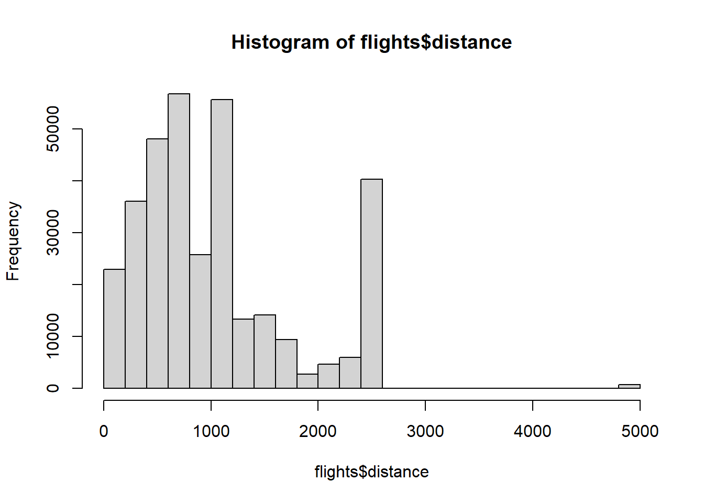
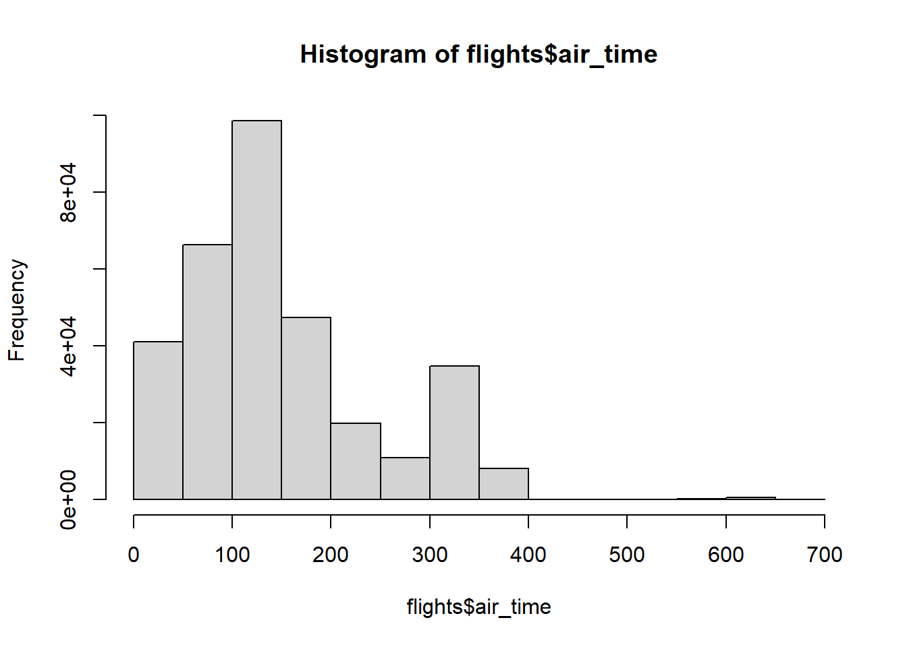
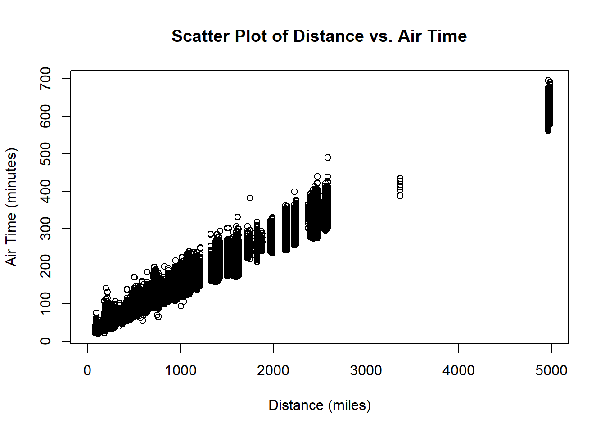

## Quarto

Quarto enables you to weave together content and executable code into a finished document. To learn more about Quarto see <https://quarto.org>.

## 


::: {.cell}

```{.r .cell-code}
library(nycflights13)
```
:::

::: {.cell}

```{.r .cell-code}
head(flights)
```

::: {.cell-output-display}

`````{=html}
<div data-pagedtable="false">
  <script data-pagedtable-source type="application/json">
{"columns":[{"label":["year"],"name":[1],"type":["int"],"align":["right"]},{"label":["month"],"name":[2],"type":["int"],"align":["right"]},{"label":["day"],"name":[3],"type":["int"],"align":["right"]},{"label":["dep_time"],"name":[4],"type":["int"],"align":["right"]},{"label":["sched_dep_time"],"name":[5],"type":["int"],"align":["right"]},{"label":["dep_delay"],"name":[6],"type":["dbl"],"align":["right"]},{"label":["arr_time"],"name":[7],"type":["int"],"align":["right"]},{"label":["sched_arr_time"],"name":[8],"type":["int"],"align":["right"]},{"label":["arr_delay"],"name":[9],"type":["dbl"],"align":["right"]},{"label":["carrier"],"name":[10],"type":["chr"],"align":["left"]},{"label":["flight"],"name":[11],"type":["int"],"align":["right"]},{"label":["tailnum"],"name":[12],"type":["chr"],"align":["left"]},{"label":["origin"],"name":[13],"type":["chr"],"align":["left"]},{"label":["dest"],"name":[14],"type":["chr"],"align":["left"]},{"label":["air_time"],"name":[15],"type":["dbl"],"align":["right"]},{"label":["distance"],"name":[16],"type":["dbl"],"align":["right"]},{"label":["hour"],"name":[17],"type":["dbl"],"align":["right"]},{"label":["minute"],"name":[18],"type":["dbl"],"align":["right"]},{"label":["time_hour"],"name":[19],"type":["dttm"],"align":["right"]}],"data":[{"1":"2013","2":"1","3":"1","4":"517","5":"515","6":"2","7":"830","8":"819","9":"11","10":"UA","11":"1545","12":"N14228","13":"EWR","14":"IAH","15":"227","16":"1400","17":"5","18":"15","19":"2013-01-01 05:00:00"},{"1":"2013","2":"1","3":"1","4":"533","5":"529","6":"4","7":"850","8":"830","9":"20","10":"UA","11":"1714","12":"N24211","13":"LGA","14":"IAH","15":"227","16":"1416","17":"5","18":"29","19":"2013-01-01 05:00:00"},{"1":"2013","2":"1","3":"1","4":"542","5":"540","6":"2","7":"923","8":"850","9":"33","10":"AA","11":"1141","12":"N619AA","13":"JFK","14":"MIA","15":"160","16":"1089","17":"5","18":"40","19":"2013-01-01 05:00:00"},{"1":"2013","2":"1","3":"1","4":"544","5":"545","6":"-1","7":"1004","8":"1022","9":"-18","10":"B6","11":"725","12":"N804JB","13":"JFK","14":"BQN","15":"183","16":"1576","17":"5","18":"45","19":"2013-01-01 05:00:00"},{"1":"2013","2":"1","3":"1","4":"554","5":"600","6":"-6","7":"812","8":"837","9":"-25","10":"DL","11":"461","12":"N668DN","13":"LGA","14":"ATL","15":"116","16":"762","17":"6","18":"0","19":"2013-01-01 06:00:00"},{"1":"2013","2":"1","3":"1","4":"554","5":"558","6":"-4","7":"740","8":"728","9":"12","10":"UA","11":"1696","12":"N39463","13":"EWR","14":"ORD","15":"150","16":"719","17":"5","18":"58","19":"2013-01-01 05:00:00"}],"options":{"columns":{"min":{},"max":[10]},"rows":{"min":[10],"max":[10]},"pages":{}}}
  </script>
</div>
`````

:::
:::

::: {.cell}

```{.r .cell-code}
hist(flights$distance)
```

::: {.cell-output-display}
{width=672}
:::
:::

::: {.cell}

```{.r .cell-code}
hist(flights$air_time)
```

::: {.cell-output-display}
{width=672}
:::
:::

::: {.cell}

```{.r .cell-code}
# Load the necessary library if it's not already loaded
# install.packages("ggplot2")
library(ggplot2)
# Create a scatter plot with custom axis labels
plot(flights$distance, flights$air_time, 
     xlab = "Distance (miles)", 
     ylab = "Air Time (minutes)", 
     main = "Scatter Plot of Distance vs. Air Time")
```

::: {.cell-output-display}
{width=672}
:::
:::


## Summary

The relationship between distance and air_time is positive linear relationship because the points tend to be straight line.
