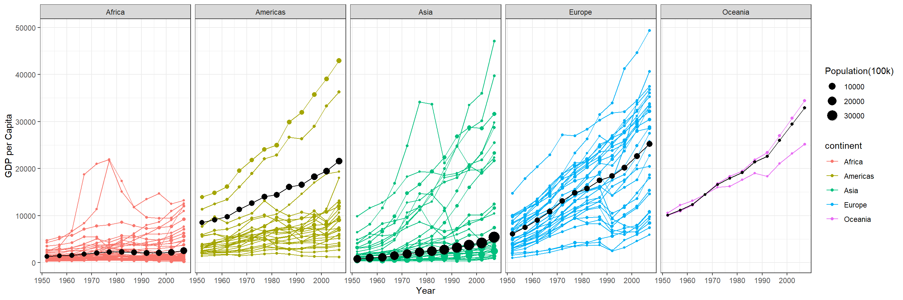

::: {.cell}

```{.r .cell-code}
library(gapminder)
library(tidyverse)
```
:::

::: {.cell}

```{.r .cell-code}
dat <- gapminder %>% filter(country != "Kuwait")
```
:::


Text


::: {.cell}

```{.r .cell-code}
weighted_avg_gdp <- gapminder %>%
  filter(country != "Kuwait") %>%
  group_by(continent, year) %>%
  summarise(
    avg_gdp = weighted.mean(gdpPercap, pop), sum_pop = sum(pop)
    )
```
:::

::: {.cell}

```{.r .cell-code}
weighted_avg_gdp
```

::: {.cell-output-display}

`````{=html}
<div data-pagedtable="false">
  <script data-pagedtable-source type="application/json">
{"columns":[{"label":["continent"],"name":[1],"type":["fct"],"align":["left"]},{"label":["year"],"name":[2],"type":["int"],"align":["right"]},{"label":["avg_gdp"],"name":[3],"type":["dbl"],"align":["right"]},{"label":["sum_pop"],"name":[4],"type":["dbl"],"align":["right"]}],"data":[{"1":"Africa","2":"1952","3":"1311.2214","4":"237640501"},{"1":"Africa","2":"1957","3":"1444.9520","4":"264837738"},{"1":"Africa","2":"1962","3":"1540.5991","4":"296516865"},{"1":"Africa","2":"1967","3":"1774.8474","4":"335289489"},{"1":"Africa","2":"1972","3":"2063.1713","4":"379879541"},{"1":"Africa","2":"1977","3":"2244.7985","4":"433061021"},{"1":"Africa","2":"1982","3":"2295.1919","4":"499348587"},{"1":"Africa","2":"1987","3":"2180.7643","4":"574834110"},{"1":"Africa","2":"1992","3":"2071.6145","4":"659081517"},{"1":"Africa","2":"1997","3":"2098.8650","4":"743832984"},{"1":"Africa","2":"2002","3":"2201.9071","4":"833723916"},{"1":"Africa","2":"2007","3":"2560.9296","4":"929539692"},{"1":"Americas","2":"1952","3":"8528.0431","4":"345152446"},{"1":"Americas","2":"1957","3":"9097.7928","4":"386953916"},{"1":"Americas","2":"1962","3":"9760.2517","4":"433270254"},{"1":"Americas","2":"1967","3":"11329.6444","4":"480746623"},{"1":"Americas","2":"1972","3":"12663.7315","4":"529384210"},{"1":"Americas","2":"1977","3":"14015.8925","4":"578067699"},{"1":"Americas","2":"1982","3":"14410.5681","4":"630290920"},{"1":"Americas","2":"1987","3":"16091.0009","4":"682753971"},{"1":"Americas","2":"1992","3":"16566.9208","4":"739274104"},{"1":"Americas","2":"1997","3":"18279.9914","4":"796900410"},{"1":"Americas","2":"2002","3":"19453.6897","4":"849772762"},{"1":"Americas","2":"2007","3":"21602.7458","4":"898871184"},{"1":"Asia","2":"1952","3":"794.0231","4":"1395197351"},{"1":"Asia","2":"1957","3":"982.7813","4":"1562567753"},{"1":"Asia","2":"1962","3":"1149.9520","4":"1695998916"},{"1":"Asia","2":"1967","3":"1441.8686","4":"1905087897"},{"1":"Asia","2":"1972","3":"1866.2432","4":"2150130314"},{"1":"Asia","2":"1977","3":"2184.2579","4":"2383373199"},{"1":"Asia","2":"1982","3":"2441.5829","4":"2608638088"},{"1":"Asia","2":"1987","3":"2762.2175","4":"2869329275"},{"1":"Asia","2":"1992","3":"3220.0459","4":"3131874096"},{"1":"Asia","2":"1997","3":"3761.4971","4":"3381520155"},{"1":"Asia","2":"2002","3":"4178.4868","4":"3599690642"},{"1":"Asia","2":"2007","3":"5404.8298","4":"3809448268"},{"1":"Europe","2":"1952","3":"6096.6591","4":"418120846"},{"1":"Europe","2":"1957","3":"7535.4142","4":"437890351"},{"1":"Europe","2":"1962","3":"9057.2262","4":"460355155"},{"1":"Europe","2":"1967","3":"10808.8667","4":"481178958"},{"1":"Europe","2":"1972","3":"13104.8431","4":"500635059"},{"1":"Europe","2":"1977","3":"14813.5172","4":"517164531"},{"1":"Europe","2":"1982","3":"15782.1281","4":"531266901"},{"1":"Europe","2":"1987","3":"17483.5690","4":"543094160"},{"1":"Europe","2":"1992","3":"18420.1919","4":"558142797"},{"1":"Europe","2":"1997","3":"20227.3071","4":"568944148"},{"1":"Europe","2":"2002","3":"22644.2822","4":"578223869"},{"1":"Europe","2":"2007","3":"25244.0479","4":"586098529"},{"1":"Oceania","2":"1952","3":"10136.1021","4":"10686006"},{"1":"Oceania","2":"1957","3":"11191.9213","4":"11941976"},{"1":"Oceania","2":"1962","3":"12396.7842","4":"13283518"},{"1":"Oceania","2":"1967","3":"14514.5012","4":"14600414"},{"1":"Oceania","2":"1972","3":"16653.5796","4":"16106100"},{"1":"Oceania","2":"1977","3":"17948.5714","4":"17239000"},{"1":"Oceania","2":"1982","3":"19155.0517","4":"18394850"},{"1":"Oceania","2":"1987","3":"21400.5439","4":"19574415"},{"1":"Oceania","2":"1992","3":"22593.0327","4":"20919651"},{"1":"Oceania","2":"1997","3":"26014.8970","4":"22241430"},{"1":"Oceania","2":"2002","3":"29438.4479","4":"23454829"},{"1":"Oceania","2":"2007","3":"32884.5553","4":"24549947"}],"options":{"columns":{"min":{},"max":[10]},"rows":{"min":[10],"max":[10]},"pages":{}}}
  </script>
</div>
`````

:::
:::

::: {.cell}

```{.r .cell-code}
gapminder%>%head()
```

::: {.cell-output-display}

`````{=html}
<div data-pagedtable="false">
  <script data-pagedtable-source type="application/json">
{"columns":[{"label":["country"],"name":[1],"type":["fct"],"align":["left"]},{"label":["continent"],"name":[2],"type":["fct"],"align":["left"]},{"label":["year"],"name":[3],"type":["int"],"align":["right"]},{"label":["lifeExp"],"name":[4],"type":["dbl"],"align":["right"]},{"label":["pop"],"name":[5],"type":["int"],"align":["right"]},{"label":["gdpPercap"],"name":[6],"type":["dbl"],"align":["right"]}],"data":[{"1":"Afghanistan","2":"Asia","3":"1952","4":"28.801","5":"8425333","6":"779.4453"},{"1":"Afghanistan","2":"Asia","3":"1957","4":"30.332","5":"9240934","6":"820.8530"},{"1":"Afghanistan","2":"Asia","3":"1962","4":"31.997","5":"10267083","6":"853.1007"},{"1":"Afghanistan","2":"Asia","3":"1967","4":"34.020","5":"11537966","6":"836.1971"},{"1":"Afghanistan","2":"Asia","3":"1972","4":"36.088","5":"13079460","6":"739.9811"},{"1":"Afghanistan","2":"Asia","3":"1977","4":"38.438","5":"14880372","6":"786.1134"}],"options":{"columns":{"min":{},"max":[10]},"rows":{"min":[10],"max":[10]},"pages":{}}}
  </script>
</div>
`````

:::
:::

::: {.cell}

```{.r .cell-code}
ggplot() + 
  geom_point(data=dat, aes(x=year, y=gdpPercap, color = continent, group = country, size = pop/100000)) + 
  geom_line(data=dat, aes(x=year, y=gdpPercap, color = continent, group = country)) + 

# Add black lines for continent weighted averages

  geom_line(

   data = weighted_avg_gdp, aes(x = year, y = avg_gdp), color = "black"
   ) +
 # Add black lines for continent weighted averages

  geom_point(

    data = weighted_avg_gdp, aes(x = year, y = avg_gdp, size = sum_pop/100000), color="black"
  ) +
  labs(
    x = "Year",
    y = "GDP per Capita", size = "Population(100k)"
  )+ 
  facet_wrap(~ continent, nrow = 1)+ 
  theme_bw()
```

::: {.cell-output-display}
{width=1440}
:::

```{.r .cell-code}
 # scale_y_continuous(trans = "sqrt")
```
:::


\+

\# Add black lines for continent weighted averages

geom_line(

data = weighted_avg_gdp,

aes(group = continent),

color = "black",

size = 1

) +

\# Add black dots for continent weighted averages

geom_point(

data = weighted_avg_gdp,

aes(color = continent),

size = 3

)
