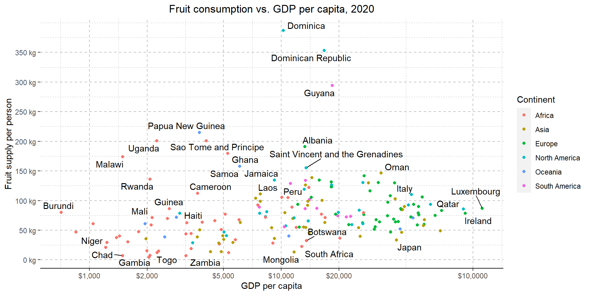
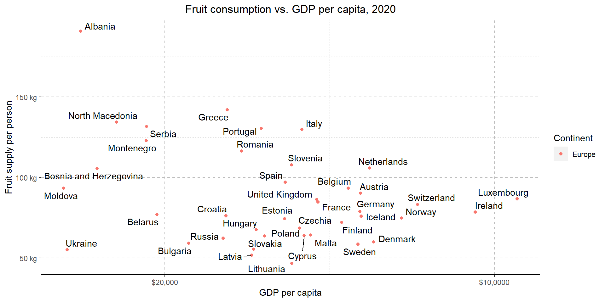

::: {.cell}

:::

::: {.cell}

:::

::: {.cell}
::: {.cell-output-display}
{width=960}
:::
:::

::: {.cell}

:::

::: {.cell}
::: {.cell-output-display}
{width=960}
:::
:::

::: {.cell}
::: {.cell-output-display}
{width=960}
:::
:::

## Summary
Creating these graphs has been a valuable learning experience for me, especially when it comes to effectively segregating data and crafting visualizations that incorporate multiple datasets.