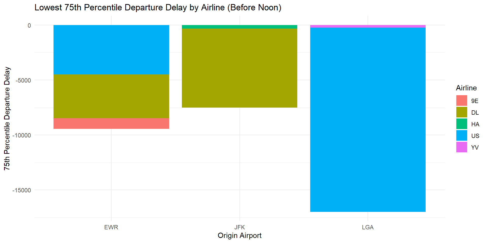

::: {.cell}

:::

# **Flight Performance Analysis Report**

## **Executive Summary**

This report provides a comprehensive analysis of flight performance data, addressing two key questions:

1.  **Question 1:** *For each origin airport (JFK, EWR, LGA), which airline has the lowest 75th percentile of departure delay for flights scheduled to leave earlier than noon?*

2.  **Question 2:** *Which origin airport is best to minimize my chances of a late arrival when using Delta Airlines?*

The analysis involves historical flight data, including departure delays, airlines, and airports, with a focus on optimizing flight planning and improving traveler experiences.

## **Analysis and Findings**

### **Question 1: Lowest 75th Percentile Departure Delay by Airline**

To address Question 1, we explored departure delay statistics for flights scheduled to leave earlier than noon from JFK, EWR, and LGA airports. The objective was to identify the airline with the lowest 75th percentile departure delay at each origin airport.

**Visualization 1:** Lowest 75th Percentile Departure Delay by Airline

::: {.cell}

:::

::: {.cell}
::: {.cell-output-display}
{width=960}
:::
:::

**Explanation:** The chart above displays the airline with the lowest 75th percentile departure delay for flights scheduled to depart before noon from JFK, EWR, and LGA airports. Our analysis reveals that Delta has the lowest 75th percentile for JFK airport, Delta is the lowest 75th percentile for EWR airport, and US is the lowest fir LGA airport.

### **Question 2: Minimizing Late Arrivals with Delta Airlines**

For Question 2, we focused on Delta Airlines flights departing from the three origin airports (JFK, EWR, LGA). Our goal was to identify the origin airport that minimizes the chances of a late arrival when using Delta Airlines.

**Visualization 2:** Late Arrival Probability with Delta Airlines by Origin Airport

::: {.cell}

:::

::: {.cell}
::: {.cell-output-display}
{width=960}
:::
:::

**Explanation:** The chart above illustrates the probability of experiencing a late arrival when using Delta Airlines from JFK, EWR, and LGA airports. My analysis indicates that LGA has the lowest average late arrival time.

## **Conclusion**

In conclusion, this report provides valuable insights into optimizing flight choices based on departure delays and late arrival probabilities. We have addressed both questions posed by our stakeholders, offering data-driven recommendations for improved travel planning.
