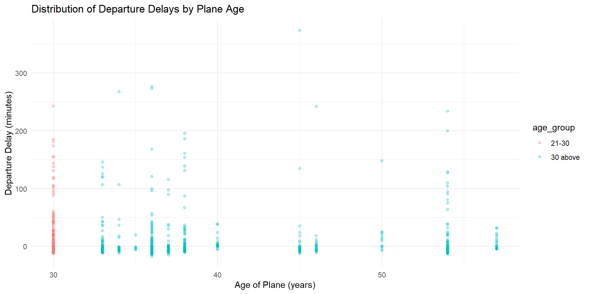
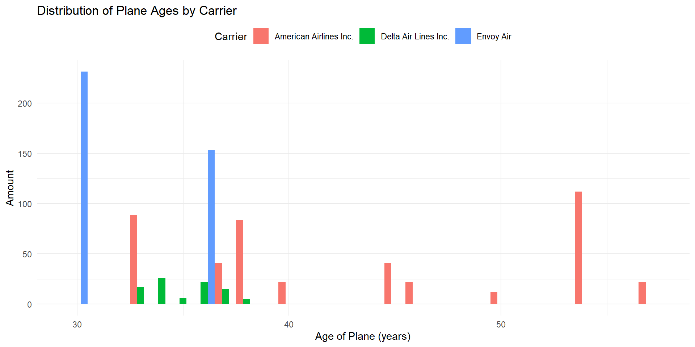
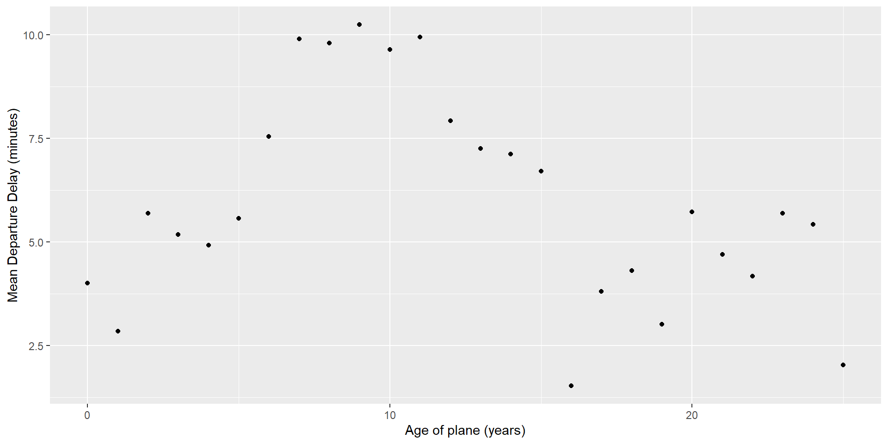

::: {.cell}

:::

::: {.cell}

:::

::: {.cell}
::: {.cell-output-display}
{width=960}
:::
:::

::: {.cell}

:::

::: {.cell}
::: {.cell-output-display}
{width=960}
:::
:::

Notice only American Airline has plans that are 39 year or older.

::: {.cell}

:::

::: {.cell}
::: {.cell-output-display}
{width=960}
:::
:::

Delays increase with the age of the plane until ten years, then it declines and flattens out.
