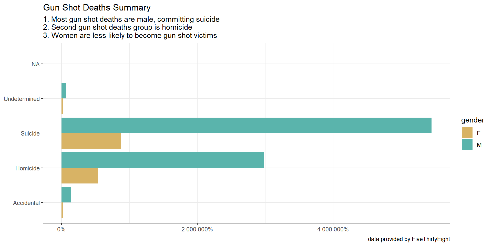
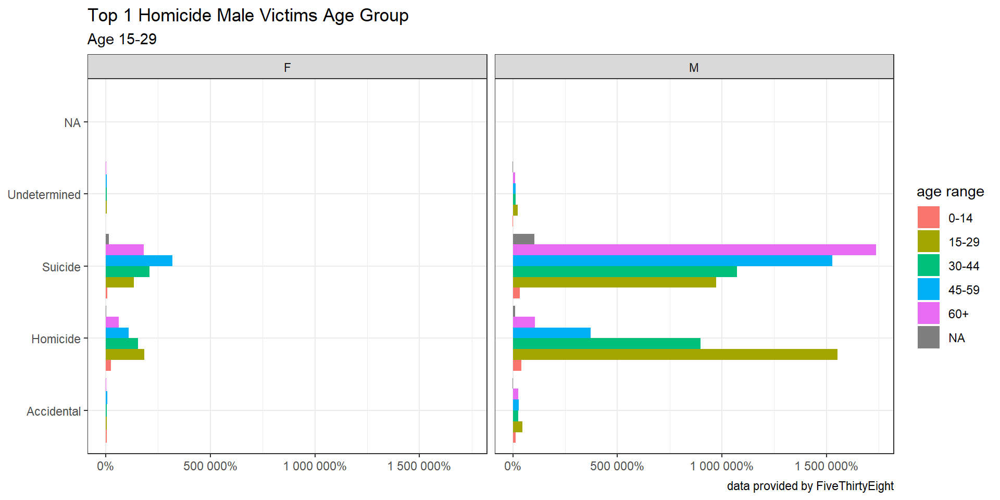
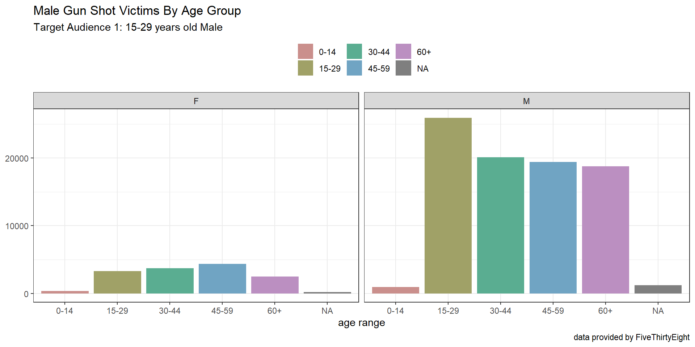
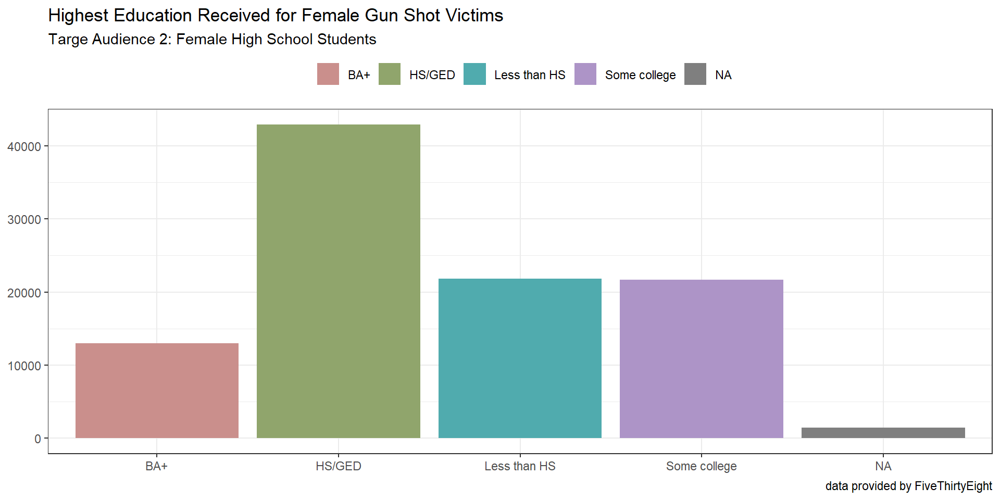
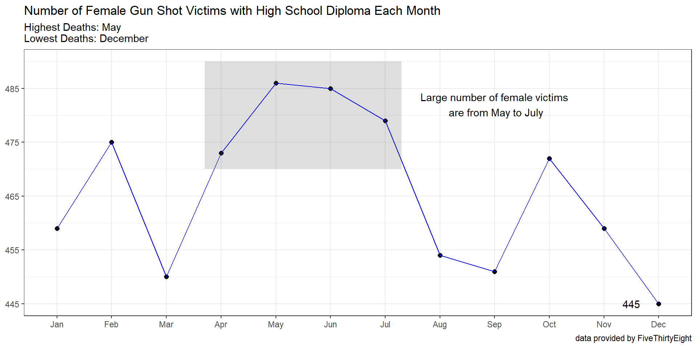
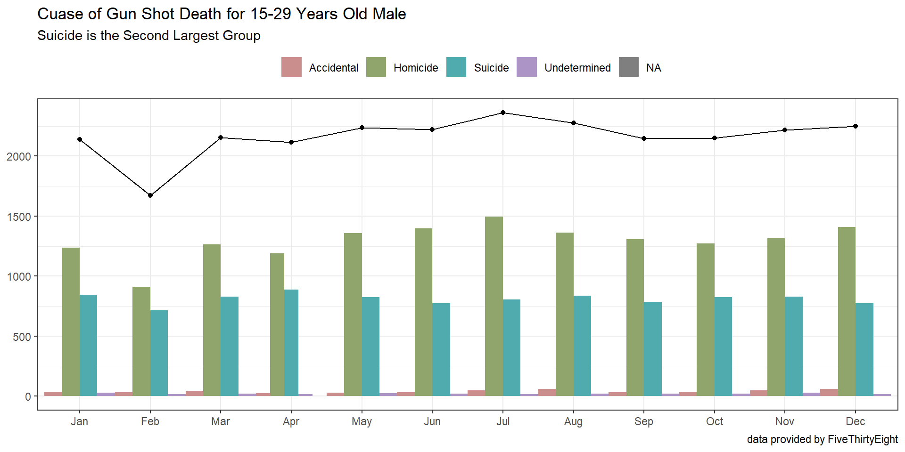

::: {.cell}

:::

::: {.cell}

:::

### Background
***
You are working for a client who wants to create a marketing campaign that helps reduce gun deaths in the US. The client would like to identify several target audiences that could benefit from such a campaign, as well identify any seasonal trends in gun deaths in these target audiences.

### Introduction 
***
This project, we dived into the causes and different demographics of gun shot deaths. We also determined the two main target audiences: 15-29 years old male and female high school students. 

### Graph Insights
***
The first graph shows that the majority of gun deaths victims are male. The largest gun deaths group is caused by suicide. The second largest gun deaths group is a result of homicide. Only a small portion of women died from gun usage. 

::: {.cell}
::: {.cell-output-display}
{width=960}
:::
:::

The second graph shows that most homicide male deaths are young men aging 15-29.

::: {.cell}
::: {.cell-output-display}
{width=960}
:::
:::

### Target Audiences
***
After data analysis, we decided to choose _male aging 15-29_ & _female high school students_. 
From the first provided graph, we see that more than 30,000 young men who are 15-29 years old are gun death victims. 
As for female demographic, based on the summary bar graph, we noticed that the highest education most women dying from gun shots received is high school diploma. 
In conclusion, based on what we gathered and analyzed, we propose targeting High School girls and 15-29 year-old males. 

::: {.cell}

:::

::: {.cell}

:::

::: {.cell}

:::

::: {.cell}

:::

::: {.cell}

:::

::: {.cell}
::: {.cell-output-display}
{width=960}
:::
:::

::: {.cell}
::: {.cell-output-display}
{width=960}
:::
:::

### Seasonal Trend 1: Target Audience 2 (Female High Schoolers)
***
From the collected data, we found out that starting from April to July, gun shot victims of our target audience increased. Therefore, we recommend reach out to them through social media ads and campaigns to help raise awareness. 

::: {.cell}
::: {.cell-output-display}
{width=960}
:::
:::

### Seasonal Trend 2: Target Audience 2 (15-29 Years old Male)
***
From the findings, the numbers of gun deaths for our target audience each month do not have an obvious high or low, meaning there isn't any month that has the highest deaths. However, homicide is the second dominant cause of gun shot deaths after homicide, we would suggest that the campaign focus more on suicide prevention. 

::: {.cell}
::: {.cell-output-display}
{width=960}
:::
:::
