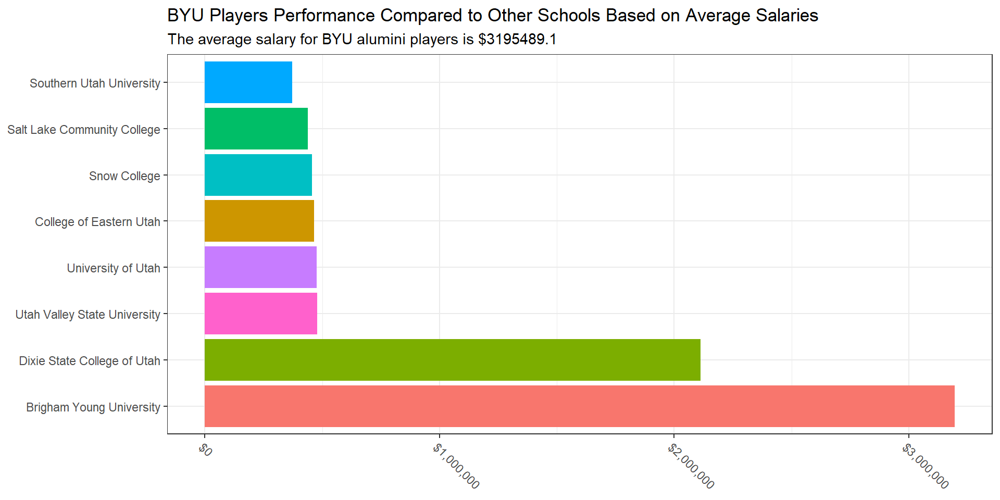
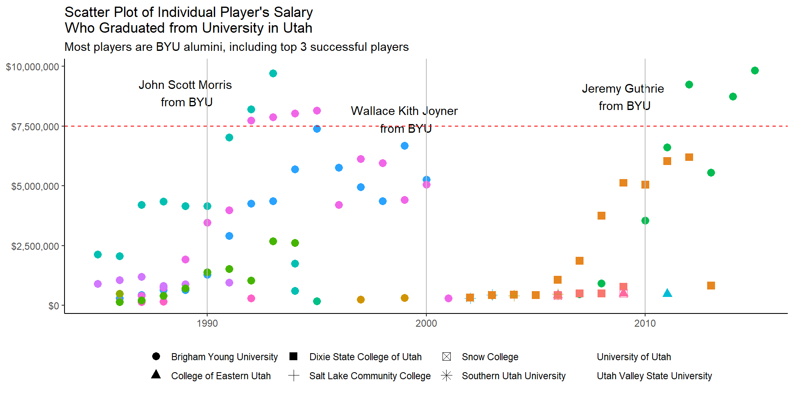

::: {.cell}

:::

::: {.cell}
::: {.cell-output .cell-output-stdout}
```
Generating URL to request all 297 results
Retrieving inflation data for US 
Generating URL to request all 63 results
```
:::
:::

::: {.cell}
::: {.cell-output-display}
--------------------------------------------------------------------------------
 playerID             school                    player            yearID   lgID 
----------- -------------------------- ------------------------- -------- ------
 aguilri01   Brigham Young University   Richard Warren Aguilera    1986     NL  

 aguilri01   Brigham Young University   Richard Warren Aguilera    1987     NL  

 aguilri01   Brigham Young University   Richard Warren Aguilera    1988     NL  

 aguilri01   Brigham Young University   Richard Warren Aguilera    1989     NL  

 aguilri01   Brigham Young University   Richard Warren Aguilera    1990     AL  

 aguilri01   Brigham Young University   Richard Warren Aguilera    1991     AL  
--------------------------------------------------------------------------------

Table: Table continues below

 
-----------------------
 salary    salary_2020 
--------- -------------
 130000      306961    

 195000      444164    

 295000      645614    

 310000      647202    

 648000      1283574   

 1533333     2913862   
-----------------------
:::
:::

::: {.cell}
::: {.cell-output-display}
{width=960}
:::
:::

::: {.cell}
::: {.cell-output-display}
{width=960}
:::
:::


## Summarize

From chart 1, we compared the average salaries earned by players graduating from universities in Utah. We found out that BYU alumni players have more success than other Utah schools alumni. As for chart 2, the scatter plot supports our finding that BYU alumni players are more successful. Three of players who got paid the most all graduated from Brigham Young University. Moreover, it is shown that most players who graduated from Utah school are from BYU.
