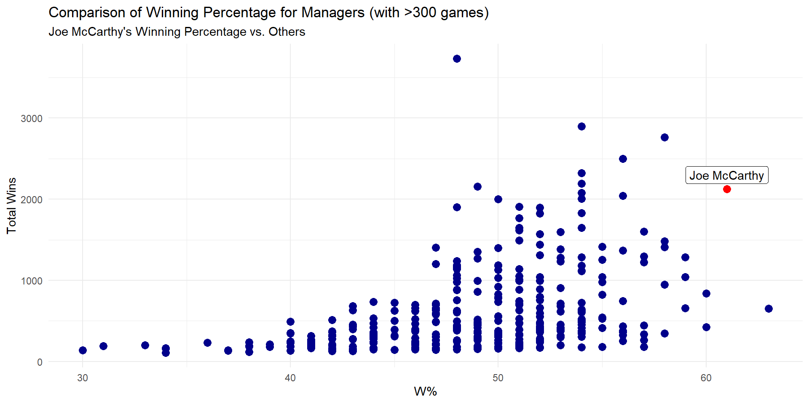
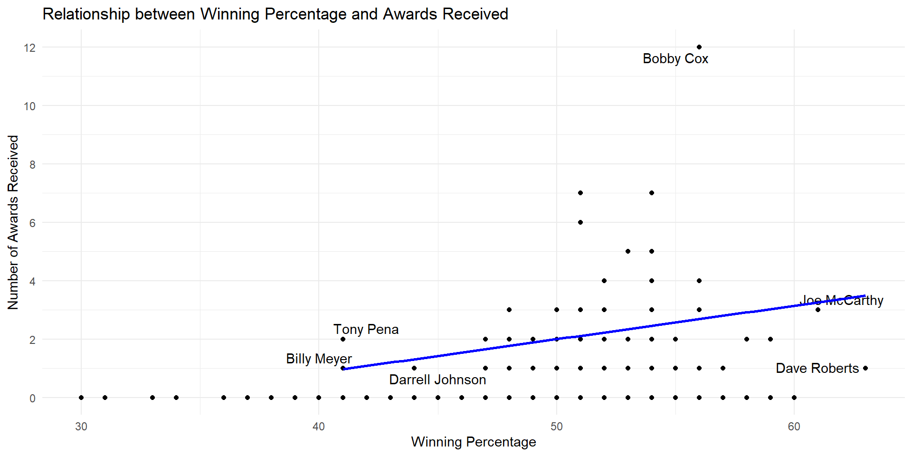

::: {.cell}

:::

::: {.cell}

:::

::: {.cell}

:::

::: {.cell}

:::

In investigating Bobby Cox's Manager of the Year awards in both the American and National League, I found that Bobby Cox indeed won this prestigious award in both leagues during his managerial career. By analyzing data from the Lahman database, specifically the "AwardsManagers" and "Managers" tables, I was able to identify that Bobby Cox received the BBWAA Manager of the Year award for his outstanding managerial performances in both leagues. This accomplishment places him among a select group of only four managers who have achieved this dual recognition. The claim about Bobby Cox's achievements in winning this award in both leagues is truthful and substantiated by historical baseball data, highlighting his exceptional managerial prowess across different leagues.

::: {.cell}

:::

::: {.cell}

:::

::: {.cell}
::: {.cell-output-display}
{width=960}
:::
:::

::: {.cell}

:::

::: {.cell}
::: {.cell-output-display}
{width=960}
:::
:::

Among the managers, we've identified outliers based on their win percentages and the number of awards received. Notably, Bobby Cox and Joe McCarthy stand out as outliers, aligning with the claims made in the article. Interestingly, none of the other "top 5 coaches" display outlier characteristics under the specified criteria. The data reveals that most award-winning managers have win percentages exceeding 50%, and even those managers who have won awards but don't qualify as outliers maintain a win rate of no less than 40%.
