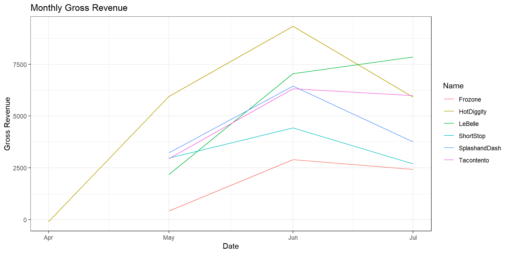
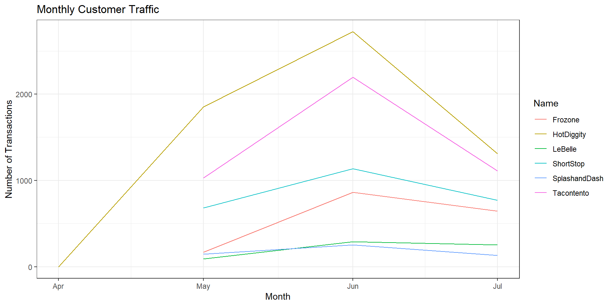
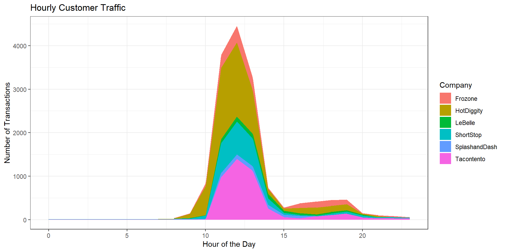

::: {.cell}

:::

::: {.cell}

:::

::: {.cell}
::: {.cell-output-display}
{width=960}
:::
:::

::: {.cell}
::: {.cell-output-display}
{width=960}
:::
:::

::: {.cell}
::: {.cell-output-display}
{width=960}
:::
:::

Based on the visualizations and data analysis, it appears that HotDiggity has performed the best over the three-month period. HotDiggity consistently maintained a higher level of gross revenue and customer traffic compared to other companies. The hourly customer traffic analysis also reveals that HotDiggity has a more extended and active operating window throughout the day, indicating a strong presence in the market. This, coupled with their consistent performance, suggests that HotDiggity has effectively capitalized on customer transactions and generated higher revenue. However, it's essential to conduct a more in-depth analysis to understand the specific factors contributing to their success and make a comprehensive assessment.
