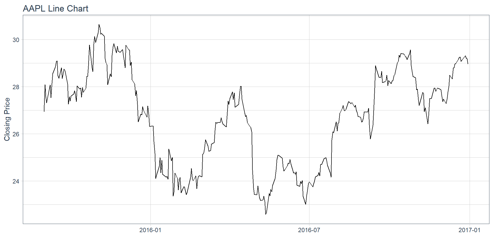
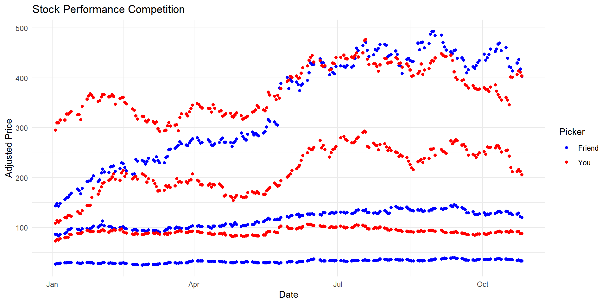
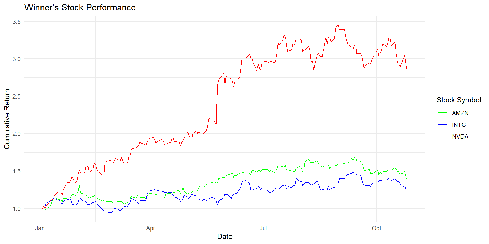

::: {.cell}

:::

::: {.cell}

:::

::: {.cell}
::: {.cell-output-display}
{width=960}
:::
:::

::: {.cell}

:::

::: {.cell}

:::

::: {.cell}

:::

::: {.cell}
::: {.cell-output-display}
{width=960}
:::
:::

::: {.cell}

:::

::: {.cell}

:::

::: {.cell}

:::

::: {.cell}
::: {.cell-output-display}
{width=960}
:::
:::

The first chart, titled "Stock Performance Competition," presents a straightforward comparison between the two participants. The choice of color-coding the Friend's stocks in blue and Your stocks in red helps distinguish their performance clearly. However, this chart does not provide a direct insight into which stocks contributed the most to the winner's success.

To address this, a second chart titled "Winner's Stock Performance" was created to specifically showcase the stocks that led to the winner's victory. In this chart, the relative performance of the winning stocks---INTC, NVDA, and AMZN---is displayed in distinct colors. This chart highlights the impact of these particular stocks on the overall success of the winner. The chosen colors for the stocks are intended to make it easy for the viewer to identify each stock.
