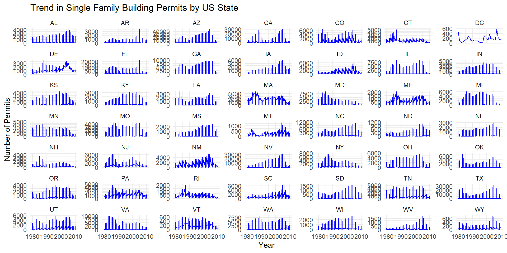

::: {.cell}

:::

::: {.cell}

:::

::: {.cell}

:::

::: {.cell}

:::

::: {.cell}
::: {.cell-output-display}
{width=960}
:::
:::

::: {.cell}

:::

::: {.cell}

:::

::: {.cell}
::: {.cell-output-display}
{width=960}
:::
:::

The graphics I created offer several insights into the trends in single-family building permits over time in the United States and Idaho. In the first chart, which displays the trend for each U.S. state, it's evident that states like California and Texas consistently have a higher number of single-family building permits. On the other hand, states like North Dakota and South Dakota show fluctuations with occasional peaks.

In the second chart that focuses on Idaho counties, Ada County, with its high population center in Boise, stands out as a consistently high-permit-issuing area. It demonstrates stable growth in single-family permits over the years. In contrast, more rural counties exhibit lower numbers. I focused on the top three cities in Idaho with the highest population. These cities were extracted from the dataset, and their population was considered a factor in understanding potential construction demand.
