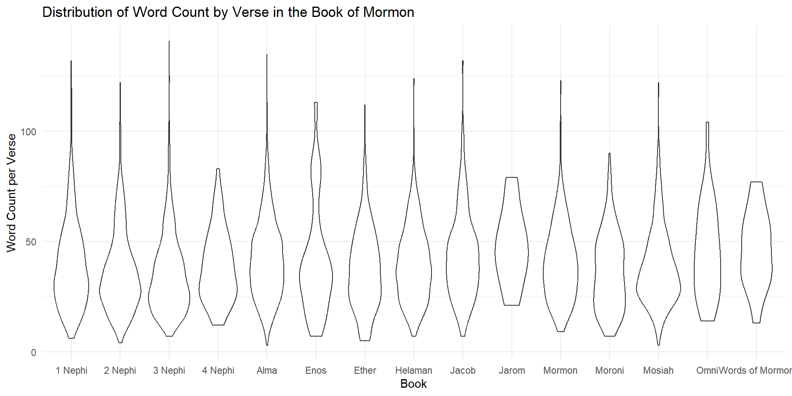

::: {.cell}

:::

::: {.cell}

:::

::: {.cell}

:::

::: {.cell}

:::

::: {.cell}
::: {.cell-output .cell-output-stdout}
```
Average Verse Length in the New Testament: 188.33 words
```
:::

::: {.cell-output .cell-output-stdout}
```
Average Verse Length in the Book of Mormon: 336.41 words
```
:::
:::

::: {.cell}

:::

::: {.cell}
::: {.cell-output .cell-output-stdout}
```
Occurrences of 'Jesus' in the New Testament: 984 
```
:::

::: {.cell-output .cell-output-stdout}
```
Occurrences of 'Jesus' in the Book of Mormon: 184 
```
:::
:::

::: {.cell}

:::

::: {.cell}
::: {.cell-output-display}
{width=960}
:::
:::
