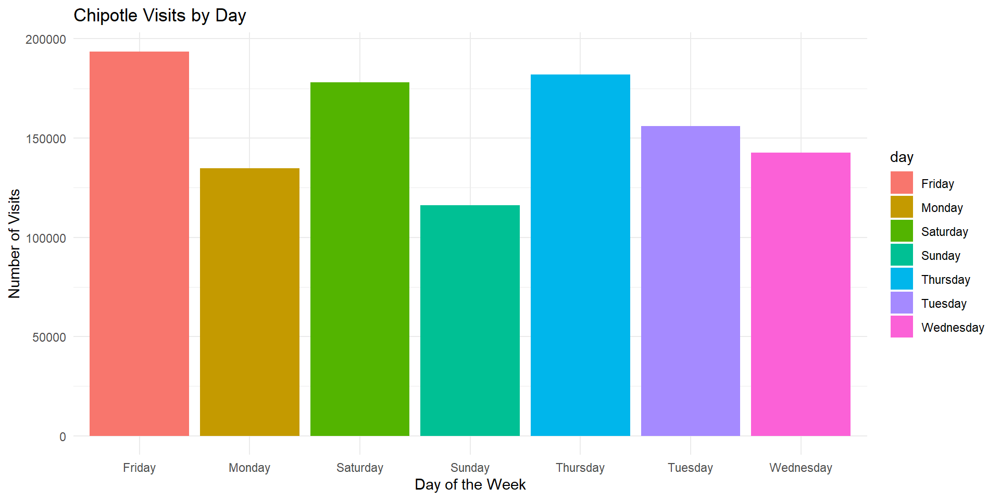

::: {.cell}

:::

::: {.cell}

:::

::: {.cell}

:::

::: {.cell}

:::

::: {.cell}
::: {.cell-output-display}
{width=960}
:::
:::

Based on the graphed data, I recommend that Chipotle leadership consider running the promotion on Friday or Saturday, as these days exhibit higher numbers of visits compared to other weekdays, potentially maximizing the impact and reach of the promotion.
