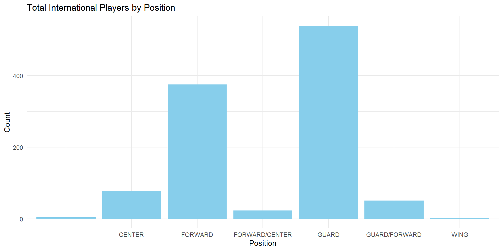

::: {.cell}

:::

::: {.cell}

:::

More than 25 teams have at least seven non-U.S. players on their rosters, South Florida has 12, San Francisco 10 and six teams have nine each (Simon Fraser has 14 but it is located in Canada).

::: {.cell}

:::

Of the 95 teams that have at least one Australian player, 25 of them have two or more on their roster. Southern Nazarene WBB has *six* Aussies.

::: {.cell}

:::

::: {.cell}

:::

::: {.cell}

:::

::: {.cell}

:::

Looking at the proposition of international and U.S players

::: {.cell}
::: {.cell-output-display}
{width=960}
:::
:::

::: {.cell}

:::

Looking at the total of international in each position. Found out Guard and Center are the two common positions from other countries.

::: {.cell}
::: {.cell-output-display}
{width=960}
:::
:::

Looking at the average height between International players and US players

::: {.cell}
::: {.cell-output-display}
{width=960}
:::
:::

are certain positions or player types more common among international players compared to U.S. players?

::: {.cell}

:::

Looking for which positions are common in US and International

::: {.cell}
::: {.cell-output-display}
{width=960}
:::
:::

::: {.cell}

:::

::: {.cell}
::: {.cell-output-display}
{width=960}
:::
:::

\
Insight Summary:

Through extensive data wrangling and visualizations, several key insights have emerged that can significantly impact decision-making for college women's basketball teams in their pursuit of potential guards and forwards:

1.  **Positional Strengths by Country:**

    -   **Spain's Dominance in Guards:** The analysis indicates that Spain has a well-established reputation for producing high-caliber guards. The visualizations highlight the consistently strong performance of Spanish players in the guard position.

    -   **Canada's Versatility:** Canada stands out not only for its excellence in the guard position but also for producing talented forwards. The data reveals a diverse pool of players, showcasing Canada's versatility in nurturing both guard and forward positions.

    -   **New Zealand and France's All-Around Talent:** The insights suggest that New Zealand and France are noteworthy for their basketball programs, excelling in both guard and forward positions. This versatility can be advantageous for teams seeking well-rounded players.

2.  **Strategic Recruitment Considerations:**

    -   **Focused Recruitment for Specific Positions:** Teams looking to strengthen particular positions, such as guards or forwards, can strategically focus their recruitment efforts on countries known for excelling in those specific roles.

    -   **Diversification of Player Profiles:** The findings recommend diversifying recruitment strategies by considering countries with a balanced representation of both guard and forward talents. This approach ensures a versatile and well-rounded team composition.

3.  **Potential Impact on Team Composition:**

    -   **Enhanced Team Dynamics:** By incorporating players from countries renowned for specific positions, teams have the opportunity to enhance their overall dynamics. This targeted recruitment strategy can lead to a more balanced and strategically positioned roster.

    -   **Adaptable Playing Styles:** Players from these identified countries may bring diverse playing styles to a team, fostering adaptability on the court. Coaches can leverage the strengths of guards and forwards from different backgrounds for a more dynamic gameplay strategy.

4.  **Long-Term Success Factors:**

    -   **Building on Historical Strengths:** The historical strengths of Spain, Canada, New Zealand, and France in producing quality players in various positions can serve as a foundation for sustained success. Teams may consider long-term partnerships with these basketball programs.

    -   **Scouting for Emerging Talent:** Continuous monitoring of emerging talent from these countries is recommended. This proactive approach ensures that teams stay ahead in identifying and recruiting promising players as they enter the basketball scene.

In conclusion, the insights derived from the data analysis provide actionable recommendations for college women's basketball teams seeking to build competitive rosters with a strategic focus on guard and forward positions. The nuances of each country's basketball program can guide teams in making informed decisions that align with their specific recruitment goals and overall team strategy.
